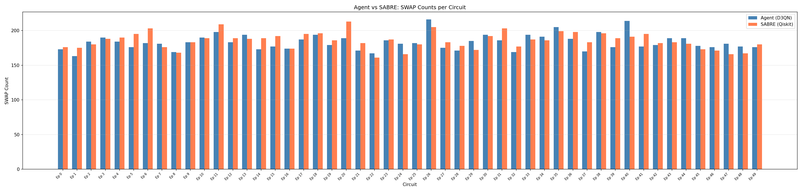
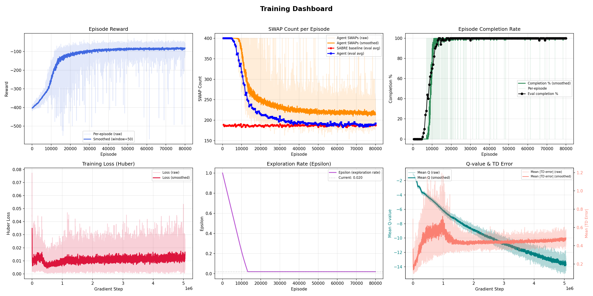
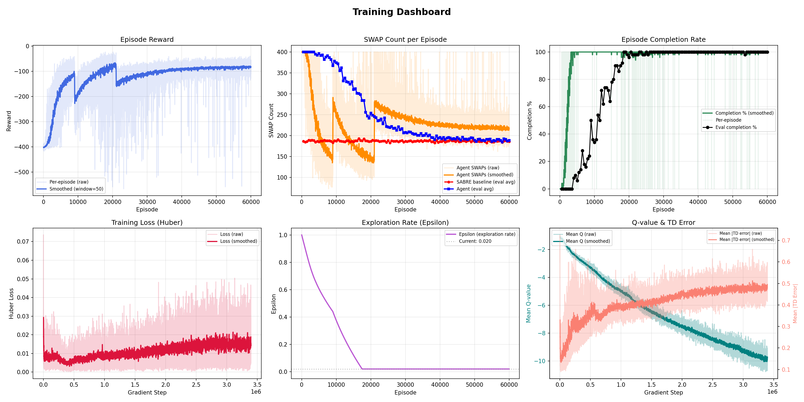

<div align="center">

# RL Quantum Circuit Routing

### Deep Reinforcement Learning for Quantum Circuit Transpilation

*A D3QN+PER agent that learns to route quantum circuits on hardware topologies, minimizing SWAP gate overhead compared to IBM's SABRE compiler.*

[](https://www.python.org/downloads/)
[](https://pytorch.org/)
[](https://qiskit.org/)
[](https://gymnasium.farama.org/)

---

**Ratio 0.991** (Beats SABRE) · **100% Completion** · **3 Hardware Topologies** · **Multi-Topology Generalization**

[Results](#results) · [Architecture](#architecture) · [How It Works](#how-it-works) · [Getting Started](#getting-started) · [Training](#training) · [Documentation](#documentation)

</div>

---

## Overview

Quantum computers can only execute two-qubit gates between **physically adjacent qubits**. Real quantum circuits contain gates between arbitrary qubit pairs. **Quantum circuit routing** (transpilation) solves this by inserting SWAP gates to move qubits into adjacent positions before each gate can execute. Fewer SWAPs = shorter circuits = less decoherence = higher fidelity results.

The industry-standard solution is **SABRE** (Li et al., 2019), a heuristic search algorithm used by IBM's Qiskit compiler. SABRE is fast and produces good results, but as a greedy heuristic, it can miss globally optimal routing strategies.

Finding the minimum number of SWAPs for a given circuit is **NP-hard** (Siraichi et al., 2018) — no known polynomial-time algorithm can compute the optimal solution. For small instances (5-10 qubits), exact methods like ILP/SAT solvers or A* search (Botea et al., 2018) can find optima, but for real hardware sizes these are intractable. Both SABRE and our agent produce approximate solutions.

**This project trains a deep RL agent to learn routing strategies end-to-end**, directly from the circuit structure and hardware topology. The agent:

1. **Observes** the hardware graph, current qubit mapping, pending gate demands, and routing progress via a 5-channel spatial state
2. **Selects** SWAP operations on hardware edges using a Dueling CNN policy
3. **Learns** from millions of routing episodes via Double DQN with Prioritized Experience Replay
4. **Generalizes** across multiple hardware topologies with a single network

<div align="center">

```
    Quantum Circuit (logical)          Hardware Topology (physical)
    +-------------------+              +-------------------------+
    | q0 --X--          |              |    0 --- 1 --- 2        |
    |      |            |              |    |           |        |
    | q1 --X-- X--      |     SWAP     |    3 --- 4 --- 5        |
    |          |        |  --------->  |    |           |        |
    | q2 ---- X-- X--   |  insertion   |    6 --- 7 --- 8        |
    |             |     |              |   (grid_3x3: 9q, 12e)   |
    | q3 -------- X--   |              +-------------------------+
    +-------------------+
    Gates between non-adjacent          Agent inserts SWAPs to make
    qubits can't execute directly       all gates executable
```

</div>

---

## Results

### Agent vs SABRE: Routing Comparison

The agent (blue) and SABRE (orange) route the same quantum circuit on heavy_hex_19. Each frame shows one SWAP operation, with gates executing automatically when qubits become adjacent.

<div align="center">


*Run 019: RL agent routing a depth-20 circuit on heavy_hex_19 topology (19 qubits, 20 edges)*

</div>

### Best Single-Topology: Run 019 (heavy_hex_19, 80k episodes)

| Metric | Value |
|--------|-------|
| **Best Swap Ratio** | **0.991** (beats SABRE by 1%) |
| **Completion Rate** | 100% (all circuits fully routed) |
| Agent SWAPs (avg) | 183.3 |
| SABRE SWAPs (avg) | 185.3 |
| Sub-1.0 checkpoints | 8 out of 160 eval points |

Run 023 (curriculum + cosine LR) achieved ratio **0.994** in only **60k episodes** — 25% less training time than Run 019.

<div align="center">



*Best checkpoint evaluation (ep63k, ratio 0.991): per-circuit SWAP count comparison between agent (blue) and SABRE (orange)*

</div>

### Best Multi-Topology: Run 018 (3 topologies, weighted sampling)

A **single network** learns to route circuits across 3 different hardware topologies simultaneously:

| Topology | Qubits | Edges | Swap Ratio | vs SABRE |
|----------|--------|-------|------------|----------|
| linear_5 | 5 | 4 | **0.890** | **Beats SABRE by 11%** |
| grid_3x3 | 9 | 12 | **1.008** | Matches SABRE |
| heavy_hex_19 | 19 | 20 | 1.107 | 11% more SWAPs |
| **Overall** | — | — | **0.999** | **Matches SABRE** |

### Progression Across Experiments

| Version | Best Run | Heavy Hex Ratio | Key Breakthrough |
|---------|----------|-----------------|------------------|
| V1 | — | 0% completion | Q-value collapse |
| V2 | Run 7 | 1.080 | 5-channel state, soft targets, eps=0.02 |
| V3 | Run 15 | 1.014 | 60k episodes, standard net |
| **V4** | **Run 19** | **0.991** | **80k episodes — first to beat SABRE** |
| **V4** | **Run 23** | **0.994** | **Curriculum + cosine LR — beats SABRE in 60k eps** |

### Training Dashboard

<div align="center">



*Run 019 (80k episodes): Reward, completion rate, swap ratio, loss, Q-values, and epsilon over training. The characteristic "phase transition" at ep8k-12k is where the agent suddenly learns to complete circuits.*

</div>

<details>
<summary><b>Run 023 Training Dashboard (Curriculum + Cosine LR)</b></summary>

<div align="center">



*Run 023: Three curriculum phases are visible — depth 5 (ep0-9k), depth 10 (ep9k-21k), depth 20 (ep21k+). The swap curve dips during depth-10 phase because shallower circuits need fewer SWAPs.*

</div>
</details>

<details>
<summary><b>Additional Routing GIF</b></summary>

<div align="center">


*Second routing example on a different random circuit*

</div>
</details>

---

## Architecture

<div align="center">

```
+----------------------------------------------------------------------+
|                                                                      |
|   State: 5-channel N x N tensor                                      |
|   +-------+-------+----------+-----------+------------+              |
|   | Ch 0  | Ch 1  |  Ch 2    |   Ch 3    |   Ch 4     |              |
|   |Adjacen|Mapping|Gate      |Front-layer|Stagnation  |              |
|   |-cy    |Perm.  |Demand    |Distance   |Signal      |              |
|   |(27x27)|(27x27)|(27x27)   |(27x27)    |(27x27)     |              |
|   +---+---+---+---+----+-----+-----+-----+------+-----+              |
|       +-------+--------+-----------+------------+                    |
|                        |                                             |
|                        v                                             |
|   +--------------------------------------+                           |
|   |        CNN Feature Extractor         |                           |
|   |  Conv2d(5->32, 3x3) -> ReLU         |                           |
|   |  Conv2d(32->64, 3x3) -> ReLU        |                           |
|   |  Conv2d(64->32, 3x3) -> ReLU        |                           |
|   |  Flatten -> 32 x 27 x 27 = 23,328   |                           |
|   +------------------+-------------------+                           |
|                      |                                               |
|           +----------+----------+                                    |
|           v                     v                                    |
|   +------------+    +----------------+                               |
|   | Value      |    | Advantage      |                               |
|   | Stream     |    | Stream         |                               |
|   | 23328->256 |    | 23328->256     |                               |
|   | ->ReLU->1  |    | ->ReLU->20     |  (20 edges = 20 actions)      |
|   +-----+------+    +------+---------+                               |
|         |                  |                                         |
|         +------+-----------+                                         |
|                v                                                     |
|   Q(s,a) = V(s) + A(s,a) - mean(A)                                  |
|                                                                      |
|   ~6M parameters (standard) | ~24M parameters (bignet)               |
|                                                                      |
+----------------------------------------------------------------------+
```

</div>

### Key Design Decisions

| Decision | Rationale | Reference |
|----------|-----------|-----------|
| **Dueling DQN** | Separates state value from action advantage — learns "how good is this state" independently of "which SWAP is best here" | Wang et al., 2016 |
| **Double DQN** | Eliminates overestimation bias in Q-learning — online net selects actions, target net evaluates them | van Hasselt et al., 2016 |
| **Prioritized Experience Replay** | Samples high-TD-error transitions more often — focuses learning on surprising/difficult states | Schaul et al., 2016 |
| **CNN on N x N state** | Hardware topology and qubit mapping have spatial structure — convolutions capture local connectivity patterns | — |
| **5-channel state** | Encodes topology (Ch0), current mapping (Ch1), future gate demand (Ch2), immediate routing targets (Ch3), and stuck-ness signal (Ch4) | Pozzi et al., 2022 (Ch3 distance shaping) |
| **Soft target updates** | Polyak averaging (tau=0.005) gives smoother target evolution vs hard copies — prevents Q-value oscillation | Lillicrap et al., 2016 |
| **Curriculum learning** | Train on easy circuits (depth 5) first, progress to hard ones (depth 20) — gives ~10k episode head start | Bengio et al., 2009 |

---

## How It Works

### The Routing Problem

Given a quantum circuit with two-qubit gates and a hardware coupling graph, find a sequence of SWAP operations that makes all gates executable on adjacent qubits, minimizing the total number of SWAPs inserted.

This is NP-hard in general (Siraichi et al., 2018). SABRE (Li et al., 2019) solves it heuristically using bidirectional greedy search with a lookahead cost function. Our agent learns a policy directly from experience.

### Environment (MDP)

Each episode:
1. **Reset**: Pick a topology, generate a random depth-20 circuit, set a random initial qubit mapping
2. **Step**: Agent selects a SWAP (edge in the hardware graph). The SWAP is applied, then all now-routable gates execute automatically
3. **Terminate**: When all gates are executed (success, +5 bonus) or after max_steps (timeout, -10 penalty)

**Reward per step:**
```
r = -1                                    # step cost (encourages efficiency)
  + gates_executed x gate_reward           # +1 per gate routed (progress signal)
  + distance_coeff x delta_distance        # Pozzi-style distance shaping
  + repetition_penalty (if same SWAP)      # -0.5 prevents swap-undo loops
  + completion_bonus (if done)             # +5 for completing all gates
  + timeout_penalty (if truncated)         # -10 for running out of steps
```

### Training Algorithm

**D3QN + PER** (Double Dueling DQN with Prioritized Experience Replay):

1. Collect transitions via epsilon-greedy exploration (epsilon: 1.0 -> 0.02)
2. Store in prioritized replay buffer (SumTree, capacity 300-500k)
3. Sample mini-batches weighted by TD error magnitude
4. Compute Double DQN targets: `y = r + gamma^n * Q_target(s', argmax Q_online(s'))`
5. Minimize Huber loss weighted by importance-sampling corrections
6. Soft-update target network every 500 steps (tau = 0.005)

### Multi-Topology Generalization

A single agent can learn routing across multiple hardware topologies simultaneously:
- State observations are padded to a fixed N x N size (N=27 covers all topologies)
- Actions beyond the current topology's edge count are masked
- Weighted topology sampling ensures the hardest topology (heavy_hex) gets sufficient training time

---

## Getting Started

### Prerequisites

- Python 3.10+
- PyTorch 2.0+ with CUDA
- Qiskit 1.0.2

### Installation

```bash
git clone <repo-url>
cd rl-quantum-circuit-routing
python -m venv .venv
source .venv/bin/activate
pip install torch --index-url https://download.pytorch.org/whl/cu118
pip install qiskit==1.0.2 gymnasium==0.29.1 networkx==3.2.1 \
            numpy==1.26.4 matplotlib==3.8.3 imageio tqdm
```

### Quick Start

**Train with a preset:**
```bash
# Sanity check (~5 min)
python main.py train --preset linear5

# Primary heavy_hex training (~16h on GPU)
python main.py train --preset heavy_hex --episodes 60000 --device cuda

# Multi-topology generalization
python main.py train --preset multi --episodes 80000 --device cuda
```

**Train with a custom config:**
```bash
python main.py train --config configs/run14_heavy_hex_60k.json --device cuda
```

**Evaluate a checkpoint:**
```bash
python main.py evaluate \
    --checkpoint outputs/run_019/checkpoints/checkpoint_final.pt \
    --episodes 100 \
    --save-trajectories \
    --output-dir eval_results
```

### SLURM Cluster

```bash
# Using config files
sbatch experiment.slurm configs/run14_heavy_hex_60k.json

# With CLI overrides
sbatch experiment.slurm heavy_hex --episodes 80000 --seed 123
```

The SLURM script automatically: trains the agent, evaluates the final checkpoint, and generates visualizations. All outputs land in `outputs/run_NNN/`.

---

## Training

### Hyperparameters (Best Configuration)

| Parameter | Value | Notes |
|-----------|-------|-------|
| Algorithm | D3QN + PER | Double Dueling DQN |
| Conv channels | [32, 64, 32] | Standard net (~6M params) |
| Dueling hidden | 256 | |
| Learning rate | 1e-4 | Cosine annealing to 1e-5 recommended |
| Discount (gamma) | 0.99 | |
| Batch size | 128 | |
| Buffer capacity | 300,000-500,000 | |
| PER alpha | 0.6 | Priority exponent |
| PER beta | 0.4 -> 1.0 | IS weight annealing |
| Epsilon | 1.0 -> 0.02 | Linear decay over 4-6M steps |
| Target update | tau=0.005 every 500 steps | Soft Polyak |
| Gradient clip | 10.0 | Max gradient norm |
| Episodes | 60,000-100,000 | More is better (curve not flat) |
| Curriculum | depth 5 -> 10 -> 20 | Optional, saves ~25% training time |

### Compute Requirements

| Resource | Requirement |
|----------|-------------|
| GPU | Any CUDA GPU (RTX 3090 recommended) |
| Training time | ~16h for 60k episodes on heavy_hex |
| GPU memory | ~2-4 GB |
| Evaluation | ~5 min per 100 episodes |

### Output Structure

```
outputs/run_NNN/
├── config.json                 # Full configuration snapshot
├── quicksum.md                 # One-line experiment summary
├── logs/
│   ├── episodes.jsonl          # Per-episode: reward, swaps, completion
│   ├── train_steps.jsonl       # Per-step: loss, Q-values, TD error, LR
│   └── evaluations.jsonl       # Per-eval: swap ratio, completion rate
├── checkpoints/
│   ├── checkpoint_ep10000.pt   # Periodic checkpoints
│   └── checkpoint_final.pt     # Final model
├── figures/
│   ├── training_curves.png     # 6-panel training dashboard
│   ├── eval_comparison_*.png   # Agent vs SABRE bar charts
│   └── routing_*.gif           # Animated routing trajectories
├── eval/
│   ├── eval_ep*.json           # Evaluation results per checkpoint
│   └── random_eval.json        # Final evaluation
└── results_summary.json        # Aggregate results for quick comparison
```

---

## Project Structure

```
rl-quantum-circuit-routing/
├── src/
│   ├── environment.py          # Gymnasium env: 5-channel state, SWAP actions, reward
│   ├── networks.py             # DuelingCNN: Conv2d stack + V/A streams
│   ├── dqn_agent.py            # D3QN agent: PER, n-step, epsilon, LR scheduling
│   ├── replay_buffer.py        # SumTree + PrioritizedReplayBuffer
│   ├── config.py               # TrainConfig dataclass + presets
│   ├── train.py                # Main training loop with curriculum support
│   ├── evaluate.py             # Evaluation + SABRE comparison
│   ├── visualize.py            # Training dashboard + routing GIFs
│   ├── circuit_utils.py        # Quantum circuit DAG, front layer, coupling maps
│   └── explore.py              # Interactive exploration utilities
├── configs/                    # JSON configs for each experiment run
├── assets/                     # Figures and GIFs for README
├── outputs/                    # All experiment outputs (auto-numbered, gitignored)
├── main.py                     # CLI entry point (train/evaluate/visualize)
├── experiment.slurm            # SLURM job script (train + eval + viz)
├── ARCHITECTURE.md             # Detailed technical documentation
├── outputs.md                  # Full experiment log and analysis
└── README.md
```

---

## Documentation

| Document | Description |
|----------|-------------|
| [ARCHITECTURE.md](ARCHITECTURE.md) | Complete technical reference (~1200 lines): MDP formulation with math, network architecture, D3QN+PER algorithm, training pipeline, multi-topology support, reward design, experimental findings, and paper references |
| [outputs.md](outputs.md) | Full experiment log: every run's config, results, detailed analysis, and cross-run comparison. Covers V1-V4 findings (23 runs) and V5 plans |

---

## References

- **SABRE**: Li, G., Ding, Y., & Xie, Y. (2019). *Tackling the Qubit Mapping Problem for NISQ-Era Quantum Devices.* ASPLOS.
- **Qubit Routing Problem**: Cowtan, A., et al. (2019). *On the Qubit Routing Problem.* TQC.
- **NP-hardness**: Siraichi, M. Y., et al. (2018). *Qubit allocation.* CGO.
- **Optimal Routing**: Botea, A., et al. (2018). *On the complexity of quantum circuit compilation.* SOCS.
- **Token Swapping**: Miltzow, T., et al. (2016). *Approximation and Hardness of Token Swapping.* ESA.
- **Dueling DQN**: Wang, Z., et al. (2016). *Dueling Network Architectures for Deep Reinforcement Learning.* ICML.
- **Double DQN**: van Hasselt, H., Guez, A., & Silver, D. (2016). *Deep Reinforcement Learning with Double Q-learning.* AAAI.
- **Prioritized Experience Replay**: Schaul, T., et al. (2016). *Prioritized Experience Replay.* ICLR.
- **RL for Routing**: Pozzi, M. G., et al. (2022). *Using Reinforcement Learning to Perform Qubit Routing in Quantum Compilers.* ACM Computing Surveys.
- **AlphaRouter**: Fosel, T., et al. (2021). *Quantum circuit optimization with deep reinforcement learning.* arXiv:2103.07585.
- **Curriculum Learning**: Bengio, Y., et al. (2009). *Curriculum Learning.* ICML.

---

## License

This project is released under the MIT License.

---

<div align="center">

*Built with [PyTorch](https://pytorch.org/) · [Qiskit](https://qiskit.org/) · [Gymnasium](https://gymnasium.farama.org/)*

</div>
