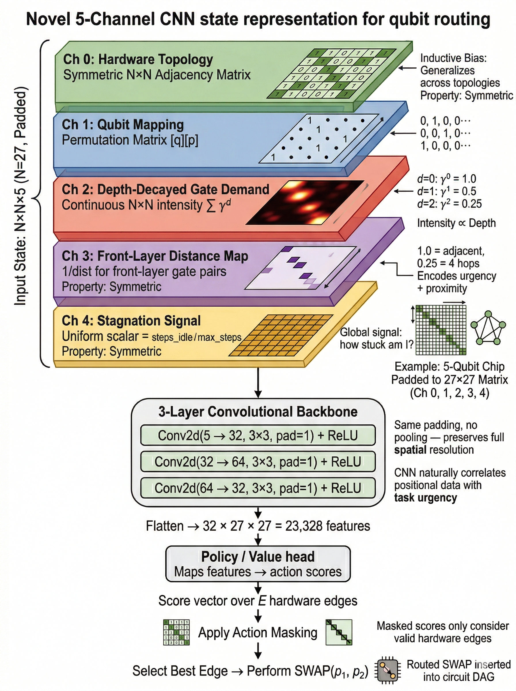

<div align="center">

# RL Quantum Circuit Routing

### Deep Reinforcement Learning for Quantum Circuit Transpilation

*Two RL agents (PPO and D3QN+PER) that learn to route quantum circuits on hardware topologies, minimizing SWAP gate overhead compared to IBM's SABRE compiler.*

[](https://www.python.org/downloads/)
[](https://pytorch.org/)
[](https://qiskit.org/)
[](https://gymnasium.farama.org/)

---

**D3QN ratio 0.991** · **PPO ratio 0.871 on linear_5** · **100% Completion** · **3 Hardware Topologies**

[Results](#results) · [Architecture](#architecture) · [How It Works](#how-it-works) · [Getting Started](#getting-started) · [Training](#training) · [Documentation](#documentation)

</div>

---

## Overview

Quantum computers can only execute two-qubit gates between **physically adjacent qubits**. Real quantum circuits contain gates between arbitrary qubit pairs. **Quantum circuit routing** (transpilation) solves this by inserting SWAP gates to move qubits into adjacent positions before each gate can execute. Fewer SWAPs = shorter circuits = less decoherence = higher fidelity results.

The industry-standard solution is **SABRE** (Li et al., 2019), a heuristic search algorithm used by IBM's Qiskit compiler. SABRE is fast and produces good results, but as a greedy heuristic, it can miss globally optimal routing strategies.

Finding the minimum number of SWAPs for a given circuit is **NP-hard** (Siraichi et al., 2018) — no known polynomial-time algorithm can compute the optimal solution. Both SABRE and our agents produce approximate solutions.

**This project implements two deep RL agents**, each with a different exploration/optimization trade-off:

1. **D3QN + PER** (Ali Dor's branch): off-policy value-based agent with Prioritized Experience Replay. See the [`ali-dev` branch](https://github.com/helloelora/rl-quantum-circuit-routing/tree/ali-dev) for the full D3QN code, results, and reports.
2. **PPO with symmetric score map** (Elora Drouilhet's branch): on-policy actor-critic agent with a topology-aware policy head, anti-collapse engineering, and depth curriculum.

Both agents share the **same Gymnasium environment** with a 5-channel spatial state (Channel 0 hardware adjacency, Channel 1 mapping permutation, Channel 2 depth-decayed gate demand, Channel 3 front-layer distance map, Channel 4 stagnation signal).

---

## Architecture

<div align="center">



*5-channel state representation feeding the shared CNN backbone, with the D3QN dueling head shown. The PPO agent reuses the same backbone with a symmetric score map policy head and a separate value head.*

</div>

### Common Backbone

```
Input: 5 x 27 x 27 tensor (padded for all topologies)
   ↓
Conv2d(5 -> 32, 3x3) + ReLU
Conv2d(32 -> 64, 3x3) + ReLU
Conv2d(64 -> 32, 3x3) + ReLU
   ↓
Flatten -> 32 * 27 * 27 = 23,328 features
```

### Two Heads

| Agent | Head architecture | Action selection |
|-------|-------------------|------------------|
| **D3QN** | Dueling: V(s) (value stream) + A(s,a) (advantage stream), Q(s,a) = V(s) + A(s,a) - mean(A) | argmax Q(s,a) with epsilon-greedy |
| **PPO** | Symmetric score map (Conv2d 1x1 -> 27x27 score, symmetrized via (S + S^T) / 2) + separate value head | sample from softmax over valid edges |

---

## Results

### D3QN (Ali Dor's branch)

Best run: **ratio 0.991 on heavy_hex_19** (80k episodes). The fine-tuning approach (Run 029) reached **ratio 0.969** by reloading the best checkpoint with LR=1e-5.

| Topology | Best ratio | Win rate | Completion |
|----------|-----------|----------|------------|
| `linear_5` (multi-topo run) | **0.890** | 100% | 100% |
| `grid_3x3` (multi-topo run) | 1.008 | — | 100% |
| `heavy_hex_19` (single-topo) | **0.991** | 94% | 100% |
| `heavy_hex_19` (fine-tune) | **0.969** | — | 100% |

Full D3QN documentation, configs, training curves, eval comparison plots, and routing GIFs are available on the [`ali-dev` branch](https://github.com/helloelora/rl-quantum-circuit-routing/tree/ali-dev).

### PPO (Elora Drouilhet's branch)

| Topology | Steps | Best ratio | Win rate | Completion |
|----------|-------|-----------|----------|------------|
| `linear_5` | 2M | **0.871** | 94% | 100% |
| `grid_3x3` (LR annealing) | 10M | 1.096 | 38% | 100% |
| `heavy_hex_19` (curriculum 5→10→20) | 5M (killed at 24h) | not converged | — | — |

**PPO highlights:**

- **Beats SABRE by 12.9% on `linear_5`** (14.1 vs 16.2 SWAPs).
- The 5-channel state (with front-layer distance map and stagnation signal) eliminated Q-value collapse on smaller topologies.
- LR annealing (3e-4 → 3e-5) prevented late-training regression on `grid_3x3` (best ratio improved from 1.24 to 1.10).
- Heavy_hex remains an open challenge for on-policy PPO. Without prioritized experience replay to focus on rare successful transitions, the policy entropy stays near-uniform on this 19-qubit topology even with depth curriculum (5 → 10 → 20). The off-policy D3QN handles this regime better.

### Anti-Collapse Engineering (PPO Contribution)

Vanilla PPO collapses on this combinatorial action space — the policy spams a single SWAP. Our fixes:

- **Reverse-swap penalty** (-0.2): penalizes immediate undo of the previous SWAP.
- **Progressive same-edge penalty** (-0.2 × streak, capped at -2.0): blocks repeated reuse of the same edge.
- **No-progress termination**: truncates the episode after 30-50 steps without any gate executed, with a strong timeout penalty.
- **Action-repeat logit penalty** (-0.20): soft logit subtraction on the previous action during forward pass.
- **Symmetric score map** in the policy head: enforces SWAP(i,j) = SWAP(j,i) at the architecture level.

These fixes were necessary to prevent degenerate policies and enable stable PPO training on linear and grid topologies.

---

## How It Works

### The Routing Problem

Given a quantum circuit with two-qubit gates and a hardware coupling graph, find a sequence of SWAP operations that makes all gates executable on adjacent qubits, minimizing the total number of SWAPs inserted.

### Environment (MDP)

Each episode:
1. **Reset**: pick a topology, generate a random circuit, set a random initial qubit mapping (mixed: 80% random, 20% SABRE).
2. **Step**: agent selects a SWAP (edge in the hardware graph). The SWAP is applied, then all now-routable front-layer gates execute automatically (cascading).
3. **Terminate**: when all gates are executed (success, completion bonus) or after max_steps (timeout penalty) or after a no-progress streak (early truncation).

**Reward per step:**
```
r = gate_reward * gates_executed         # +1 per gate routed
  + distance_coeff * delta_distance       # Pozzi-style distance shaping
  + step_penalty                          # -0.05 per step (efficiency)
  + reverse_swap_penalty                  # -0.2 if SWAP == previous SWAP
  + repeat_swap_penalty                   # -0.2 * streak (capped at -2.0)
  + no_progress_penalty                   # -0.03 * streak (capped at -1.5)
  + completion_bonus (if done)            # +15 (PPO) / +5 (D3QN)
  + timeout_penalty (if truncated)        # -8 (PPO) / -10 (D3QN)
```

### Multi-Topology Generalization

A single agent can learn routing across multiple hardware topologies simultaneously:
- State observations are padded to a fixed `27 x 27` size (covers all supported topologies).
- Actions beyond the current topology's edge count are masked (-inf logit / -inf Q-value).
- Weighted topology sampling ensures the hardest topology gets sufficient training time.

---

## Getting Started

### Prerequisites

- Python 3.10+
- PyTorch 2.0+ with CUDA
- Qiskit 1.0.2

### Installation

```bash
git clone https://github.com/helloelora/rl-quantum-circuit-routing.git
cd rl-quantum-circuit-routing
python -m venv .venv
source .venv/bin/activate
pip install -r requirements.txt
```

### Quick Start (PPO branch)

```bash
# Linear_5 — fast sanity check (~30 min on GPU)
python -m src.main --topologies "linear_5" --total-timesteps 2000000

# Grid_3x3 — 10M steps, ~6h on GPU
python -m src.main --topologies "grid_3x3" --total-timesteps 10000000 \
                   --learning-rate 3e-4 --learning-rate-end 3e-5

# Heavy_hex curriculum — multi-stage depth ramp
python -m src.main --curriculum --topologies "heavy_hex_19" \
                   --stage1-topologies "heavy_hex_19" \
                   --stage2-topologies "heavy_hex_19" \
                   --stage1-depth 5 --stage2-depth 10 --stage3-depth 20 \
                   --stage1-steps 1000000 --stage2-steps 3000000 --stage3-steps 6000000
```

### SLURM Cluster (La Ruche)

```bash
# Build the Apptainer image (one-time)
bash ruche/setup_ruche.sh

# Launch a single-topology run
sbatch ruche/run_linear5.sh
sbatch ruche/run_grid3x3.sh
sbatch ruche/run_heavyhex_curriculum_v2.sh
```

### Quick Start (D3QN branch)

For D3QN training, switch to the `ali-dev` branch and follow its dedicated instructions:

```bash
git checkout ali-dev
# See ali-dev README for training commands and configs
```

---

## Project Structure

```
rl-quantum-circuit-routing/
├── src/
│   ├── environment.py          # Gymnasium env: 5-channel state, SWAP actions, reward
│   ├── agent.py                # PPO agent with symmetric CNN actor-critic
│   ├── main.py                 # CLI entry point + curriculum runner
│   ├── visualize.py            # Training curves + eval comparison plots
│   └── circuit_utils.py        # DAG, front layer, coupling maps, SABRE baseline
├── docs/
│   ├── Architecture.png        # 5-channel state + CNN architecture diagram
│   ├── poster.tex              # Final poster source
│   └── architecture_explained.md  # Notes on PPO/D3QN, channels, training loop
├── ruche/                      # SLURM scripts for La Ruche cluster
│   ├── setup_ruche.sh          # Build Apptainer image
│   ├── run_linear5.sh          # 2M steps on linear_5
│   ├── run_grid3x3.sh          # 5M steps on grid_3x3
│   ├── run_grid3x3_v2.sh       # 10M steps + LR annealing
│   ├── run_heavyhex_curriculum_v2.sh  # Depth curriculum 5->10->20
│   └── rl_qrouting.def         # Apptainer image definition
├── scripts/
│   └── summarize_run.py        # Extract key metrics from a run dir
├── notebooks/                  # Colab notebooks for exploration
├── main.py                     # Top-level CLI
├── benchmark.py                # SABRE baseline benchmark
├── requirements.txt
└── README.md
```

---

## Documentation

| Document | Description |
|----------|-------------|
| [docs/architecture_explained.md](docs/architecture_explained.md) | Notes on PPO vs D3QN, the 5-channel state, the CNN architecture, and the training loop |
| [docs/poster.tex](docs/poster.tex) | Final poster source (LaTeX) |
| [`ali-dev` branch](https://github.com/helloelora/rl-quantum-circuit-routing/tree/ali-dev) | Full D3QN+PER implementation, configs, results, and `ARCHITECTURE.md` |

---

## References

- **SABRE**: Li, G., Ding, Y., & Xie, Y. (2019). *Tackling the Qubit Mapping Problem for NISQ-Era Quantum Devices.* ASPLOS.
- **NP-hardness**: Siraichi, M. Y., et al. (2018). *Qubit allocation.* CGO.
- **PPO**: Schulman, J., et al. (2017). *Proximal Policy Optimization Algorithms.* arXiv:1707.06347.
- **Dueling DQN**: Wang, Z., et al. (2016). *Dueling Network Architectures for Deep Reinforcement Learning.* ICML.
- **Double DQN**: van Hasselt, H., Guez, A., & Silver, D. (2016). *Deep Reinforcement Learning with Double Q-learning.* AAAI.
- **Prioritized Experience Replay**: Schaul, T., et al. (2016). *Prioritized Experience Replay.* ICLR.
- **RL for Routing**: Pozzi, M. G., et al. (2022). *Using Reinforcement Learning to Perform Qubit Routing in Quantum Compilers.*

---

## Authors

- **Ali Dor** — D3QN+PER agent ([`ali-dev` branch](https://github.com/helloelora/rl-quantum-circuit-routing/tree/ali-dev))
- **Elora Drouilhet** — PPO agent (`elora-ruche` branch)

CentraleSupélec — MSc Reinforcement Learning project, 2026.

---

## License

This project is released under the MIT License.
